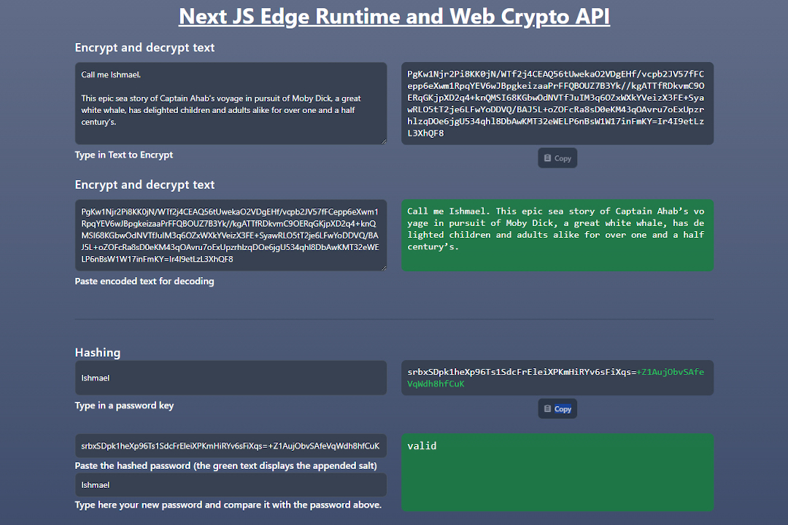

# Web Crypto API in Next JS Edge Runtime - Basic encryption / decryption / hashing functions

With Node´s now built-in support of the crypto module, you would think it would be easy to implement in Next JS as well.

But Next JS uses on the top edge runtime for performance reasons and you have only limited access to node modules.

For example if you want to encrypt or decrypt a session token inside the middleware you would need to use the Web Crypto API which has basic cryptographic functionality only.

While the functions `cipherText` (aka encoding) and `decipherText` (aka decoding) only offer basic cryptographic security, e.g. to store less sensitive data such as user settings in a session token, the hashing functions `hashPassword` and `compare` offer increased security by salting the password. The appended saltet string (base64) is marked green in this Next JS app and is used to make rainbow list attacks from hashed passwords more difficult.

<mark>Make sure to use those encryption and hashing functions only serverside.</mark>



## Getting Started

First, run the development server:

```bash
npm run dev
# or
yarn dev
# or
pnpm dev
# or
bun dev

```

To work properly you need to add a SECRET_KEY to your environmental variables in the root directory of your local storage `.env.local`.

```bash
SECRET_KEY=xxxxxxxxxxxxxxxxxxxxxxxxxxxxx
```

A good and fast way to get a randomized base64 string of bytes In Node is this shell command:

```bash
openssl rand -base64 32
```

Open [http://localhost:3000](http://localhost:3000) with your browser to see the result.

## Test

To run vitest you can call

```bash
npm run test
# or
yarn test
# or
pnpm test
# or
bun test

```
